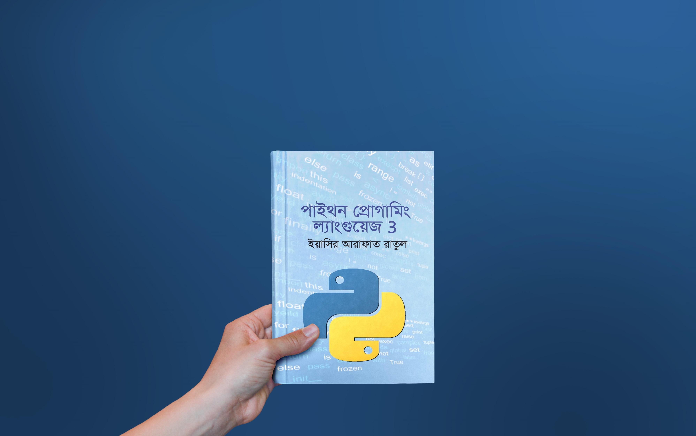

# Bangla Python E Book - Free Version

## The Book is renamed as 'Python Programming Language' and THE EXTENDED HARD COPY is available [here](https://www.rokomari.com/book/208621/python-programing-language-3).
## Publisher: ShobdoShoili Prokashoni শব্দশৈলী প্রকাশনী

**HUNT PYTHON**
*~Yeasir Arafat Ratul* 
 
*Here you will get first 8 chapters of the main book*

## Cover

**CHAPTERS**

1. Python Basics

2. Data Types
	* General Data Types
		* Integral (Int,Bool)
		* Floating (Float)
		* Strings (str)
	* Collection Type
		* Sequence (list,tuple)
		* Set (set, frozen set)
		* Mapping (dict, counter)

3. Control Structures
    * Conditional Statements
    * Loop
        * for
        * while
        * range
        * enumerate
        * zip

4. Python Comprehensions
	* List Comprehension
	* Dictionary Comprehension
	* Set Comprehension

5. Functional Programming
	* Function
	* Arguments of function
		* Default
		* Required
		* Keyword
		* Variable Length
	* Recursion
	* Anonymous/Lambda function
	* Constructors
	* Generators
	* Some Built-in functions
	   * map()
	   * filter()
	   * eval()
	   * exec()
	   * str()
	   * repr()

6. Exceptions
    * common errors
    * try-except
    * finally
    * else

7. Object Oriented Programming
    * class
    * object
    * Inheritance 
    * Polymorphism
    * Encapsulation
    * Abstraction
    * MetaClass
    * super()

8. HTTP - requests
	* GET
	* POST
	* Session & Cookies

9. Files
    * Reading
    * Writing
    * Apending
    * Binary File Read & Write

10. Decorators
    * Decorators
    * Multiple Decorators
    * Decorators With Argument

11. Networking - Socket
	* Making Server & Client
	* Making a ChatBox

12. Regular Expression
    * meta character
    * character set
    * scape code & anchoring
    * problem solving

13. Asynchronous Programming
    * introduction to asynchrounous programming
	* async await
	* co routine
	* task
	* event loop

14. Some Important Modules
    * os
    * sys
    * math
    * json
    * queue
    * deque
    * smtp
